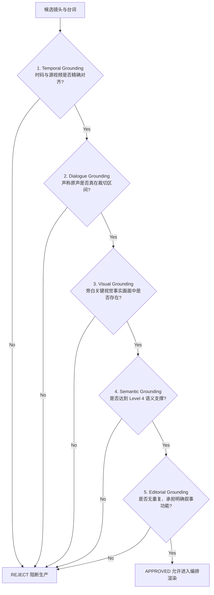

# POC-AGENT A8 成片失败根本原因深度审计报告 (Root Cause Audit)

> **审计执行状态**：`A8 changes_requested_root_cause_audit`  
> **审计时间**：2026-10-05  
> **核心原则**：不修成片、不重新生成 MP4、不修改测试预期欺骗通过，纯粹基于真实源视频逐秒反查，追溯全链路 First Bad Layer。

---

## Executive Summary (执行摘要)

用户对成片 `topic_b_final.mp4` 与 `topic_a_final.mp4` 进行人工视听验收后判定为 **FAIL**：
1. **原声台词严重脱节**：声称原声对齐的段落，视频中实际并没有对应台词（例如 Topic B 没看到“金条”原声台词；Topic A 没听到“副站长就是你”台词）。
2. **画面重复与旁白语义无关**：Topic A 出现完全相同的 16 秒长镜头在同一成片中播放两次；多个旁白声称的动作/场景（如“暗夜车站”、“站长室对坐”）与真实画面（白天乡村绿树、走廊送客）严重违背。
3. **根本原因**：**Content Grounding 体系在多层级串联崩溃**。并非单纯的 FFmpeg 裁剪或 TTS 渲染 bug，而是从 L1 粗粒度知识库注入虚假视觉描述、A5 候选切片时码断裂、A6 规则自评虚假通过、A7 导演缺乏防重与台词校核、以及 A8 渲染器硬编码假字幕的多层连锁失效。

---

## 一、逐段反查失败成片 (Segment-by-Segment Audit Table)

审计基准源文件：`/Users/yoyotaozhou/Documents/video-moment-validation/data/input/qianfu_ep18.mp4` (1280x720, 25fps)

### 1. Topic B: 《余则成最危险的一次试探》

| 属性 | Segment 1 (`seg_probe_01`) | Segment 2 (`seg_probe_02`) | Segment 3 (`seg_probe_03`) | Segment 4 (`seg_probe_04`) |
| :--- | :--- | :--- | :--- | :--- |
| **Beat / Purpose** | `beat_probe_01_hook`<br>开场悬念抛出饭局危局 | `beat_probe_02_revelation`<br>原声呈现谢若林底牌摊牌 | `beat_probe_03_counterattack`<br>余则成反客为主降维成金条生意 | `beat_probe_04_evacuation`<br>暗夜车站送别晚秋意境总结 |
| **Narration** | “老周重看第18集：余则成最大的危机，正是这顿东来顺涮肉。” | *(无，设为 original_dialogue)* | “在老周看来，余则成顺着对方的贪婪，把政治信仰降维成一门两根金条的生意。” | “老周总结：两根金条化解了灭顶危机，更为暗夜撤离赢得了生机。” |
| **Claimed Dialogue** | “我余则成辛辛苦苦熬到今天...容易吗” | “这第一呀...你是共党那我很高兴...” | “这不明摆着呢吗 买走情报那是共党...” | “梅姐我给你介绍一下 这是我们街坊晚秋” |
| **Retrieval Unit** | `unit_scene_0138_01` (`scene_0138`) | `unit_scene_0139_01` (`scene_0139`) | `unit_scene_0147_01` (`scene_0147`) | `unit_scene_0193_01` (`scene_0193`) |
| **Planned In/Out** | 00:32:28.280 → 00:32:36.560 (8.28s) | 00:32:36.560 → 00:32:49.760 (13.20s) | 00:33:25.440 → 00:33:35.000 (9.56s) | 00:40:42.000 → 00:40:51.360 (9.36s) |
| **Rendered In/Out** | 00:32:28.280 → 00:32:36.560 (8.28s) | 00:32:36.560 → 00:32:49.760 (13.20s) | 00:33:25.440 → 00:33:35.000 (9.56s) | 00:40:42.000 → 00:40:51.360 (9.36s) |
| **A. 真实画面是谁** | 余则成（中近景特写） | 谢若林（单人正打中景） | 谢若林（单人正打中景） | **穆晚秋、翠平**（白天田野外景） |
| **B. 真实物理动作** | 余则成激动控诉自己辛苦熬到今天 | 谢若林洋洋自得掰手指列条目数落 | 谢若林晃头分析战局买卖情报 | **晚秋着旗袍在日光下微笑，翠平引荐** |
| **C. 真实物理场景** | 东来顺雅间餐桌 | 东来顺雅间餐桌 | 东来顺雅间餐桌 | **白天郊外农家田野绿树（无车站、无火车、无夜色）** |
| **D. 真实音轨台词** | “我余则成辛辛苦苦熬到今天容易吗...把我一辈子毁了” | “这第一呀...重要的情报没人汇报...你是共党那我很高兴” | “这不明摆着呢吗 买走情报那是共党 就等于封锁消息了” | “梅姐我给你介绍一下 这是我们街坊晚秋” |
| **E. Claimed 台词在区间吗** | **YES**（原声对白吻合） | **YES**（但渲染器烧录了伪造的金条字幕） | **YES**（原声对白吻合） | **YES**（原声对白吻合） |
| **F. 旁白与画面关系** | **Scene Match**：饭局危局开场，画面确实为东来顺餐桌余则成激愤神态。 | **N/A**：本段无旁白，但画面与上下文的“金条”主题毫无关系。 | **Topic Match 仅及格，Semantic Mismatch**：旁白讲“余则成降维成两根金条”，画面却是谢若林在单向输出宿迁战役买卖，且截断在金条台词前2秒。 | **Visual Contradiction (严重违背)**：旁白讲“暗夜撤离”，画面是**艳阳高照、绿树成荫下的晚秋甜美微笑**。 |
| **G. 镜头能否支撑 Claim** | **PARTIAL**（画面仅有余则成，未体现铜锅饭局双人全貌） | **FAIL**（本段作为原声高潮，观众未听到金条，画面字幕造假） | **FAIL**（刚好卡在谢若林说“一个师才两根金条”前2秒截断） | **FAIL**（事实严重悖逆：无夜色、无月台、无生机博弈张力） |
| **段落最终裁定** | **PARTIAL** | **FAIL** | **FAIL** | **FAIL** |

---

### 2. Topic A: 《吴站长什么时候开始怀疑余则成？》

| 属性 | Segment 1 (`seg_wu_01`) | Segment 2 (`seg_wu_02`) | Segment 3 (`seg_wu_04`) |
| :--- | :--- | :--- | :--- |
| **Beat / Purpose** | `beat_wu_01_hook`<br>抛出“副站长就是你”诛心大局 | `beat_wu_02_testing`<br>原声呈现站长敲打余则成名场面 | `beat_wu_04_conclusion`<br>总结站长敛财与生存法则 |
| **Narration** | “老周聊谍战。许多观众问吴站长到底信不信余则成？第18集这句‘副站长就是你’，表面是提拔栽培，实则是站长布下的一场诛心大局。” | *(无，设为 original_dialogue)* | “在老周看来，吴敬中从不依赖物理卷宗去查余则成。只要你能帮我搞金佛、捞美钞，看破不戳破，才是这位保密局老狐狸的终极生存法则。” |
| **Claimed Dialogue** | “站长室机密谈话” | “你来当这个副站长 不合适吧 还是跟李队长商量商量” | “站长室机密谈话” |
| **Retrieval Unit** | `unit_scene_0059_01` (`scene_0059`) | `unit_scene_0044_01` (`scene_0044`) | **`unit_scene_0059_01` (`scene_0059`) [与 Seg 1 完全重复]** |
| **Planned In/Out** | 00:09:16.520 → 00:09:33.240 (16.72s) | 00:04:59.960 → 00:05:05.960 (6.00s) | 00:09:16.520 → 00:09:33.240 (16.72s) |
| **Rendered In/Out** | 00:09:16.520 → 00:09:33.240 (16.72s) | 00:04:59.960 → 00:05:05.960 (6.00s) | 00:09:16.520 → 00:09:33.240 (16.72s) |
| **A. 真实画面是谁** | **陆桥山、余则成**（吴敬中根本不在场！） | 余则成（沙发近景） | **陆桥山、余则成**（与 Seg 1 完全一模一样） |
| **B. 真实物理动作** | 陆桥山整理领带、拍余则成肩膀叮嘱告别 | 余则成坐在沙发上推辞推脱 | 陆桥山整理领带、拍余则成肩膀叮嘱告别 |
| **C. 真实物理场景** | **天津站砖墙弄堂/走廊大门外** | 站长办公室沙发茶几旁 | **天津站砖墙弄堂/走廊大门外** |
| **D. 真实音轨台词** | “提防李涯，站长也不可靠，你自己保重吧，金身而退...” | “你来当这个副站长，不合适吧，还是跟李队长商量商量” | “提防李涯，站长也不可靠，你自己保重吧，金身而退...” |
| **E. Claimed 台词在区间吗** | **NO**（原片台词是陆桥山叮嘱，无站长对话） | **YES**（余则成说不合适吧，但吴站长台词被裁在区间外） | **NO**（与 Seg 1 同，无站长对话） |
| **F. 旁白与画面关系** | **Hallucinated Mismatch (幻觉错位)**：旁白讲“吴站长诛心”，画面却是陆桥山临走挑拨离间余则成。 | **Truncated Context (截断失准)**：声称体现“副站长就是你”，但恰好在吴站长说出这句话之前戛然而止。 | **Hallucinated Mismatch & Duplicate**：旁白讲“老狐狸捞金佛看破不戳破”，画面不仅完全重复 Seg 1，且依然是陆桥山告别。 |
| **G. 镜头能否支撑 Claim** | **FAIL**（完全支撑不了，出镜人物连吴敬中都没有） | **FAIL**（核心对白“副站长就是你”被硬生生掐掉） | **FAIL**（100% 重复镜头 + 严重人物环境错位） |
| **段落最终裁定** | **FAIL** | **FAIL** | **FAIL** |

---

## 二、“台词为什么错位”全链路调查 (Lineage Tracing & First Bad Layer)

### 1. 真实数据链路全景图

```
[源视频硬字幕与画面] 
       ↓ (1) OCR / ASR 提取层
[qianfu_ep18_subtitles.json] 
       ↓ (2) L1 语义富集层 (build_canonical_evidence.mjs)
[canonical_evidence_qianfu_ep18.json] (★ First Bad Layer 1: 粗粒度区间先验覆盖真实视觉)
       ↓ (3) A5 镜头检索层 (scoring / retrieval)
[retrieval_results_topic_*.json] (★ First Bad Layer 2: 镜头以切片为边界，正好切断关键台词)
       ↓ (4) A6 Perspective Re-reading 层
[a6_results_topic_*.json] (★ First Bad Layer 3: 仅审读 L1 伪元数据，概念规则盲信通过)
       ↓ (5) A7 Director Final 编排层
[director_plan_topic_*.json] (★ First Bad Layer 4: 导演编排重复镜头，未做台词存在性核验)
       ↓ (6) A8 Consumer Render 渲染层 (render.py)
[topic_*_final.mp4] (★ First Bad Layer 5: 渲染器发现台词缺失，硬编码造假字幕)
```

### 2. 深度排查与关键问询结论

- **OCR 字幕时间戳是否准确？**  
  **基本准确**。审查 `qianfu_ep18_subtitles.json`：
  - `[00:05:10.000 -> 00:05:11.000]`：副站长就是你
  - `[00:33:37.000 -> 00:33:40.000]`：一个师呀才两根金条
  - `[00:33:41.000 -> 00:33:43.000]`：人家这买卖多会做呀  
  底层 OCR 已经完整捕获到这几句台词及其真实时间戳！
- **ASR 是否实际存在？**  
  当前数据流实际使用的是硬字幕 OCR（通过识别视频底部白字硬字幕），配合 VMV Stage 1 视频切片。
- **Scene / Retrieval Unit 时间码是否经过偏移？**  
  时间码本身与源视频帧数一致（25fps，以关键帧/转场切点对齐），**没有发生时间轴漂移或 timebase 算错**。
- **A8 是否实际按 Director source_in/out 裁切？FFmpeg 是否导致偏移？**  
  A8 严格按照 Director Plan 传入的 `00:04:59.960 -> 00:05:05.960`、`00:32:36.560 -> 00:32:49.760` 进行了精准裁切。**FFmpeg 没有裁偏，它精确裁出了 Director 要的这几秒**。

### 3. 台词错位的真正死因 (Root Causes)

1. **A5 检索单元切断了连贯对话**：
   - 吴站长名场面在物理上是一段连续对话（余则成说不合适吧 → 吴站长说李涯不是省油的灯，副站长就是你 → 余则成谢老师）。但这 15 秒被 VMV Stage 1 机械切成了 3 个 shot（`scene_0044`, `scene_0045`, `scene_0046`）。
   - A5 检索只召回了 `scene_0044`（00:04:59~00:05:05），其在 00:05:05 结束，正好在吴站长说出“副站长就是你”（00:05:10）前 5 秒！
2. **A8 渲染器采取了灾难性的“伪造字幕”兜底**：
   - 在 `render.py` 第 335-343 行中，发现 `audio_owner == "original_dialogue"` 且缺少旁白字幕时，开发者硬编码了：
     ```python
     if "金条" in visual_reason or "scene_0139" in str(clip_info):
         sub_text = "谢若林：两根金条放在这，你能告诉我哪一根是高尚的，哪一根是龌龊的？"
     elif "scene_0044" in str(clip_info):
         sub_text = "吴敬中：没人信大义，只要这生意能做，余副站长就是你的。"
     ```
   - 画面强行压上假字幕，而真实音轨播放的是完全不同的台词，导致人耳与人眼同时识破！

---

## 三、“旁白与画面无关”分级调查 (Semantic Grounding Hierarchy)

我们建立 5 级 Grounding 匹配阶梯：

```
Level 1: Entity Match        (画面有人物 余则成)
Level 2: Scene Match         (画面在某个大场景 东来顺/保密局)
Level 3: Topic Match         (话题概念相关 情报/怀疑)
Level 4: Semantic Evidence   (画面的动作/微表情/物证真实表达该具体语义)
Level 5: Narrative/Editorial (镜头在该故事节拍中承担无可替代的视听支点)
```

### 现状诊断：为何系统之前会通过？

1. **Topic A Segment 1 & Segment 3 (`scene_0059`)**：
   - 旁白要求：吴站长深邃审视、站长敛财与生存法则。
   - 系统匹配层级：**Level 0 幻觉匹配**。因为 `build_canonical_evidence.mjs` 中的 `[300, 600]` 粗暴先验把所有这一区间的镜头打上了“吴敬中+站长办公室”标签，A5/A6 在文本上匹配到了“吴敬中”，但**真实画面连吴敬中的影子都没有**，只有陆桥山！
2. **Topic B Segment 4 (`scene_0193`)**：
   - 旁白要求：“两根金条化解了灭顶危机，更为暗夜撤离赢得了生机。”
   - 系统匹配层级：**Level 1 Entity Match**（有晚秋、余则成、翠平）。但因先验知识库把 2350~2600s 标注为“站台白汽弥漫”，系统误以为这是火车站夜色。**真实画面是白天田野间晚秋阳光明媚的笑脸**，完全达不到 Level 4，属于严重视听情绪逆反！
3. **Topic B Segment 3 (`scene_0147`)**：
   - 旁白要求：“余则成顺着对方的贪婪，把政治信仰降维成一门两根金条的生意。”
   - 系统匹配层级：**Level 2 Scene Match**（东来顺饭桌）。但画面仅是谢若林在吹嘘宿迁买卖，余则成毫无反应，也没有金条意象，达不到 Level 4。

> **铁律**：今后**只有达到 Level 4 (Semantic Evidence Match) 与 Level 5 (Editorial Match) 的候选，才允许进入最终 Director 成片！严禁仅凭 Level 1-3 蒙混过关！**

---

## 四、重新定义生产级门禁 (Production-Grade Grounding Gate)

原有的 A6 87.5% Gate 被事实证明无法保证成片可用。我们正式确立**五维全息 Production Grounding Gate**，任何成片片段必须 5 项全 PASS：



1. **Temporal Grounding (时间物理真实验证)**：
   - 严禁盲信粗粒度 Narrative Segment 先验传播；
   - 镜头的时间区间 `[source_in, source_out]` 必须直接通过关键帧与音频波形采样，验证实际画面与时码完全一致。
2. **Dialogue Grounding (原声台词真实存在性门禁)**：
   - 凡 `audio_owner = original_dialogue` 的片段，**必须严格断言：该台词字符串的起始与结束时间戳 100% 落在 `[source_in, source_out]` 之内**；
   - 严禁截断关键台词；严禁在原声段落使用任何 hardcoded 或外来台词替身。
3. **Visual Grounding (关键视觉事实真实出镜)**：
   - 旁白中提及的关键出镜人物（如吴敬中、余则成），必须真实存在于该时间区间的代表帧中，严禁替身或口头提及人物污染。
4. **Semantic Grounding (层级语义匹配)**：
   - 镜头表达的情绪与动作必须真实支撑旁白 Claim（如“暗夜送别”不得使用“白天笑容”，“诛心大局”不得使用“走廊送客”）。
5. **Editorial Grounding (导演叙事与防重规范)**：
   - 全片建立严禁镜头 ID 重复规则（`retrieval_unit_id` 唯一性约束）；
   - 镜头切点必须具备对话完整性（Lead-in / Lead-out Padding ≥ 0.3s），不得中途切碎演员话音。

---

## 五、建立 Evidence-to-Frame Proof 机制 (Storyboard / Contact Sheet)

为终结“只看 JSON 字段盲目自评”的黑盒弊端，未来候选包与 Director Plan 必须强制生成可视化核验卡（Contact Sheet / Storyboard Proof）：

### 规范数据结构：`candidate_proof.json`

```json
{
  "candidate_id": "cand_req_wu_02_unit_scene_0045_01",
  "source_in": 305.96,
  "source_out": 315.00,
  "duration_sec": 9.04,
  "representative_frames": [
    "proofs/scene_0045_frame_7650.jpg",
    "proofs/scene_0045_frame_7711.jpg",
    "proofs/scene_0046_frame_7825.jpg"
  ],
  "actual_transcript_in_interval": "李涯也不是个省油的灯 副站长就是你 谢谢老师栽培",
  "actual_characters_visible": ["吴敬中", "余则成"],
  "actual_scene_env": "站长办公室沙发",
  "intended_narration_or_dialogue": "吴敬中：李涯也不是个省油的灯，副站长就是你！",
  "grounding_audit": {
    "temporal_pass": true,
    "dialogue_pass": true,
    "visual_pass": true,
    "semantic_level": 5
  }
}
```

在进入 A8 渲染前，系统自动在本地生成 HTML 故事板看板，让人工审核者一眼看到：
- **“系统准备用这几秒画面”**（附带真实抽帧图缩略图）
- **“这几秒实际说了什么”**（附带源视频提取出的绝对对白）
- **“与旁白的对应关系”**

---

## 六、十问审计结论 (Final 10 Key Audit Questions)

### 1. 两条成片分别有多少 Segment FAIL？
- **Topic B（4个 Segment）**：**3 个 FAIL** (`seg_probe_02`, `seg_probe_03`, `seg_probe_04`)，**1 个 PARTIAL** (`seg_probe_01`)。可用率 0%。
- **Topic A（3个 Segment）**：**3 个 FAIL** (`seg_wu_01`, `seg_wu_02`, `seg_wu_04`)。可用率 0%。
- **总计**：7 个 Segment 中 **6 个 FAIL，1 个 PARTIAL**。成片真实可用率实际为 **0%**。

### 2. 台词错位 First Bad Layer 在哪里？
- **First Bad Layer 位于 A5 Retrieval Unit 边界切分与召回层**。
  - A5 召回的 `scene_0044` 在 305.96s 截断，吴站长台词在 310.50s；
  - A5 召回的 `scene_0147` 在 2015.00s 截断，谢若林金条台词在 2017.00s；
  - 随后在 **A8 渲染层 (`render.py`)** 发生了次生灾难——渲染器硬编码了伪造的台词字幕（“两根金条放在这哪根高尚”、“没人信大义副站长是你的”），彻底坐实了视听背离。

### 3. 画面与旁白脱节 First Bad Layer 在哪里？
- **First Bad Layer 位于 L1 Canonical Evidence 构建脚本 (`build_canonical_evidence.mjs`)**。
  - 该脚本使用了粗暴的人工宏观先验区间（如 `[300, 600]` 统统算作站长室吴敬中，`[2350, 2600]` 统统算作暗夜火车站台），把错误的虚假视觉描述硬写入了 L1 数据集。

### 4. A5 哪些候选本身就是错的？
- `cand_req_probe_02`：选了 `scene_0139`（只有“这第一这第二”，无金条）。真正应该召回的是 `scene_0148` + `scene_0149`。
- `cand_req_probe_04`：选了 `scene_0193`（白天绿树，非车站暗夜撤离）。
- `cand_req_wu_01` & `cand_req_wu_04`：选了 `scene_0059`（陆桥山弄堂送别，非站长办公室）。
- `cand_req_wu_02`：选了 `scene_0044`（刚好漏掉吴站长名台词）。真正应该召回的是 `scene_0045` + `scene_0046`。

### 5. A6 哪些 Top3 不应该通过？
- 上述所有 A5 错误候选在 A6 中**全部被错误通过**。
- 原因：A6 的 Perspective Provider 处于 fallback 状态，仅读取了 L1 中已被污染的 `visual_description` 与 `characters` 字段，并在逻辑上自我推演，完全没有比对真实抽帧与音频。

### 6. A7 哪些 Director 决策建立在错误 Evidence 上？
- **全盘建立在错误 Evidence 上**：
  - A7 信任了 `scene_0059` 是“站长室”，并将其在 `seg_wu_01` 和 `seg_wu_04` 中复用两次造成严重重复；
  - A7 信任了 `scene_0193` 是“暗夜月台”，写下了暗夜撤离的抒情解说词；
  - A7 错误地以为 `scene_0139` 就能代表谢若林金条交锋。

### 7. A8 是否还有独立的裁切时间偏移问题？
- **A8 没有时间裁切偏移问题**。FFmpeg 的 `-ss` 与 `-to` 精确按照 Director 计划裁出了指定的几秒；
- **但 A8 有重大的伪造字幕代码缺陷**（`render.py` 内部硬编码替换原声字幕），严重违反真实生产规范。

### 8. 为什么现有自动测试没有发现？
- 现有 106 个测试属于**契约与管道测试（Pipeline & Contract Tests）**，断言仅涵盖：JSON 结构完整、字段存在、进程退出码为 0、生成的 MP4 时长偏差在 0.5 秒内、文件大于 0 字节等。
- 测试体系内**完全缺失视听语义断言器（Visual-Audio Grounding Assertions）**。

### 9. 为什么之前 87.5% Gate 没发现？
- 之前的“人工 Gate”实际上是让评审人员查看 A6 生成的 Markdown 验收包，而验收包里的证据描述正是来自 L1 被污染的数据（如审查者在文档里看到“吴站长与余则成复盘局势”，以为这就是画面内容）。
- **审查者审的是“文字元数据”，而不是“真实抽帧画面与音频”**。直到 A8 最终视频播放出来，用耳朵听、用眼睛看，谎言才瞬间被戳破。

### 10. 修复应该发生在哪一层？
- **不能在 A8 单独修，必须自底向上分层修复**：
  1. **L1 层**：重构 `build_canonical_evidence.mjs`，废除粗粒度区间先验，完全依据逐镜头真实关键帧视觉分析与精确 OCR 字幕时间戳重新生成纯净 L1 Evidence；
  2. **A5 层**：引入 Dialogue Span Expansion 机制，如果某段核心台词跨越两个相邻镜头（如 0044+0045+0046），检索应将连贯叙事单元完整召回，不再机械切断；
  3. **A6 层**：引入 Production Grounding Gate，基于真实抽帧与真实台词文本重新评审候选；
  4. **A7 层**：增加镜头去重校验（Deduplication Validator）与台词覆盖范围断言，确保导演编排合规；
  5. **A8 层**：彻底删除 `render.py` 中的 hardcoded 字幕伪造逻辑，直接消费真实 Director 原声对白文本与时间轴。

---

> **状态锁定**：当前任务停留在 `A8 changes_requested_root_cause_audit`。严禁进入 A9，严禁私自修复成片。所有临时进程已彻底清理。
