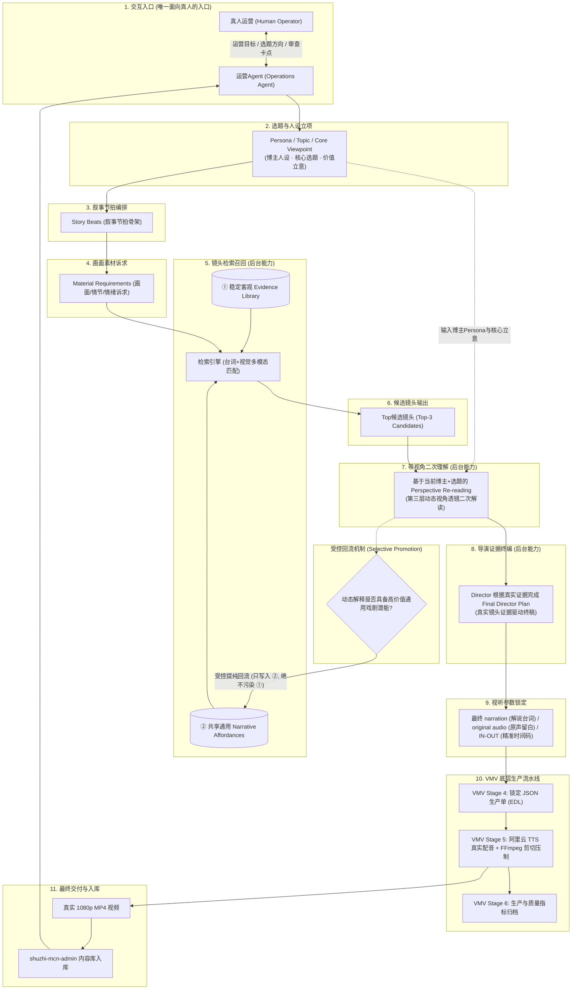

# POC-AGENT: 数智博主端到端生产工作台接线架构方案 (Topic-First Architecture)

**文档版本**: v2.2.0（Objective Evidence v2 设计）
**当前状态**: `objective_schema_v2_design_complete; awaiting_review; experiments_paused`
**责任角色**: 🏛️ 全栈架构师 & 🚀 DevOps/SRE  
**涉及工程与仓库**:
- **运营中枢**: `shuzhi-mcn-admin`（本地路径: `intelligent-pasteur/shuzhi-mcn-admin`）
- **视听引擎**: `video-moment-validation`（VMV, 本地路径: `video-moment-validation`）

---

## 当前验证基线与v2契约范围（2026-10-07）

历史Independent Judge Calibration FAIL永久保留，不等于Gemini Evidence Scientific FAIL；X1.2维持Engineering PASS / Scientific Pending。当前只设计[Objective Evidence Schema v2](objective-evidence-schema-v2.md)及[Limited X2 Retrieval Probe v1](limited-x2-retrieval-probe-v1.md)，未改运行代码、生成Evidence、运行模型/检索或新增样本。JSON定义位于[objective-evidence-schema-v2.json](objective-evidence-schema-v2.json)，是待Review设计，不替代冻结Anchor Schema。

本次L1设计supersede本文件旧L1姓名/物体/动作定义；后续契约2等示例与A0–A10路线属于Legacy接线说明，不是当前接口或解锁依据。正式路线、预注册与实验暂停以[poc-revalidation-handoff.md](poc-revalidation-handoff.md)为准；A8/A9/A10及X1.3/正式X2/X2.5继续暂停。Limited Probe本轮只设计，必须后续单独授权和冻结才能执行。本轮commit + push后STOP，等待Review。

## 一、 架构总原则与定位准则

### 1. 运营Agent 为唯一面向真人运营的交互入口
- **单一交互入口**：**运营Agent (Operations Agent)** 是全系统**唯一面向真人运营的交互入口**。
- 真人运营人员与系统的一切交互（发布运营目标、输入选题偏好、调优博主人设、确认核心立意、卡点审核与反馈干预），均统合于运营Agent的操作对话界面与卡点工作台。
- **严禁全盘 Agent 化**：Director（导演编排）、Retrieval（检索召回）、Perspective Engine（视角解读引擎）、Production Pipeline（VMV 生产流水线）均为**纯后台能力与管道服务（Backend Capabilities）**。各后台服务之间遵循确定性的数据契约与状态机驱动，杜绝无意义的多 Agent 自主握手与非确定性消耗。

### 2. 严格遵循 Topic-First 真实证据闭环
拒绝脱离实际素材凭空编写文案的“伪闭环”。视听创作的本质必须以真实客观素材为基础：
先立项核心选题（Topic/Persona/Core Viewpoint）与叙事节拍（Story Beats），提出画面诉求（Material Requirements），检索真实镜头证据并进行博主视角二次解读后，**由 Director 根据真实镜头证据敲定 Final Director Plan**，此时才最终确定台词、原声留白与入出点时间码。

### 3. 禁止重复实现 VMV 已有能力
- 严禁在后台重写视频抽帧、场景切分检测、音视频流探测、阿里云 TTS 配音调用、FFmpeg 剪切拼接或字幕压制。
- 上述能力完全复用 `video-moment-validation` (VMV) 已有及已验证的 Stage 1–6 核心管道。
- **A0 阶段只做架构设计与协议规约，不开发业务功能代码**。

---

## 二、 Topic-First 端到端接线完整架构

系统端到端流转严格遵循如下 11 步接线链路：

$$\begin{aligned}
\text{真人运营} &\longleftrightarrow \text{运营Agent} \\
&\longrightarrow \text{Persona / Topic / Core Viewpoint} \\
&\longrightarrow \text{Story Beats} \\
&\longrightarrow \text{Material Requirements} \\
&\longrightarrow \text{共享客观 Evidence Library 检索} \\
&\longrightarrow \text{Top候选} \\
&\longrightarrow \text{基于当前博主+选题的 Perspective Re-reading} \\
&\longrightarrow \text{Director 根据真实证据完成 Final Director Plan} \\
&\longrightarrow \text{最终 narration / original audio / IN-OUT} \\
&\longrightarrow \text{复用 VMV Stage4/5/6 Production} \\
&\longrightarrow \text{真实 MP4}
\end{aligned}$$

### 全链路 Mermaid 架构流转图



---

## 三、 素材理解三层体系与回流隔离机制

为确保系统具备严密的视听理解能力与自进化知识沉淀，素材理解必须被严格划分为三个层次：

```
┌────────────────────────────────────────────────────────────────────────┐
│  ③ 每条内容动态生成的 Blogger/Topic Perspective Reading               │
│  - 基于当前博主 Persona + 选题 Core Viewpoint 动态生成，具有高度主观洞察  │
│  - 随单次内容生成即时计算，初始仅与当前稿件绑定                         │
└──────────────────────────────────┬─────────────────────────────────────┘
                                   │ 高价值通用模式受控回流 (Selective Promotion)
                                   ▼
┌────────────────────────────────────────────────────────────────────────┐
│  ② 共享、可持续增量的 Generic Narrative Affordances                    │
│  - 跨博主、跨选题共享，持续沉淀通用戏剧功能与叙事潜能                  │
│  - 标签体系：试探、权力压迫、对峙、隐瞒、心理破防、假意顺从、转折等     │
└────────────────────────────────────────────────────────────────────────┘
                                   │ 严格物理只读与隔离 (Absolute Physical Isolation)
                                   ▼
┌────────────────────────────────────────────────────────────────────────┐
│  ① 稳定客观 Evidence Library                                           │
│  - 物理时间码、入出帧、人物面部识别、原片台词字幕、物理动作、场景机位   │
│  - 由 VMV Stage 1 摄取产生，绝对客观中立，任何上层逻辑绝不可篡改或污染！ │
└────────────────────────────────────────────────────────────────────────┘
```

### 1. ① 稳定客观 Evidence (物理事实层，v2设计)

- **定位**：自动Ingest产出的可追溯观察，不把模型预测当作不可动摇的真值；按原视频绝对时间保存，Human Anchor仅用于一次系统能力校准，不逐集人审入库。
- **契约**：media_id / evidence_id / span / shot_refs定位；content_regions[].content_region_type分正片、片头、片尾、预告、其他非正片、unknown。默认正片检索不混入非正片，未知保留隔离，跨类型保留分段原时间轴。
- **人物**：person_observations以anonymous person_id关联，保留Person Consistency；人数降为optional辅助，不存剧集专名或通过对白推身份。
- **视觉事实**：scene轻量；observable_actions分别定义state/event与实际观察范围；key_objects[]删除旧Object taxonomy，只记可见且符合通用关键性准则的物体，允许空，不推用途/动机/关系。
- **声音事实**：speech_segments独立保留OCR/ASR及Fusion冲突、真实原时间范围；Speaker确认才关联person_id，否则unknown。无音频的Judge不能判断语音/Speaker。
- **QA分离**：boundary_correctness与evidence_usability分开，正确切镜不等于事实可用；质量评估来源/规则明确，未评估不填正确。独立QA不写回生产事实、不进入每集Ingest。
- **下游价值**：按v2字段表与5Query Probe提出可验证用途；人物数、无用途的全局分数/Camera等降级或移出核心，检索价值未获实验证明。
- **隔离铁律**：L1保留provenance / uncertainty /分项confidence；不含情绪含义、关系、动机、剧情意义或Persona解读。字面OCR/ASR引语不升级为发生事实。后续解释层不可回写；Schema结构合规不等于事实正确。

### 2. ② 共享、可持续增量的 Generic Narrative Affordances (通用叙事潜能层)
- **定位**：镜头在戏剧叙事学上所具备的“通用表现力功能（Affordance）”。不归属于任何单一博主，是跨博主、跨选题可持续沉淀增量的通用视听知识库。
- **核心字段**：
  - `narrative_function`：戏剧功能分类（如：`probing` 试探、`power_dominance` 权力压迫、`confrontation` 对峙、`concealment` 隐瞒、`subservience` 假意顺从、`dramatic_turning` 关键转折）；
  - `dramatic_tension`：戏剧张力基线评分（0.0–1.0）；
  - `audio_affordance`：原声价值标签（`golden_quote` 金句原声、`silence_pause` 戏剧性沉默、`ambient_fx` 环境音效）；
  - `rhythm`：节奏快慢偏好。
- **作用**：检索器结合此层，能迅速按叙事功能召回合适片段，无需每次都进行暴力全量计算。

### 3. ③ 每条内容动态生成的 Blogger/Topic Perspective Reading (视角解读层)
- **定位**：在当前博主 Persona 与当前选题 Core Viewpoint 投影下，对候选镜头产生的特化主观深度解读。
- **对比示例**（相同客观镜头的第三层差异）：
  - *镜头物理事实*：余则成恭敬地给吴敬中递茶，吴敬中低头看文件未接（① 客观事实；② 叙事潜能：权力等级/试探）。
  - *博主 A（老周聊职场 · 职场博弈透镜）的 ③ 解读*：“注意余则成的手腕悬停了 1.5 秒。在职场中，给一把手倒水时领导不抬头，最好的应对就是保持悬停沉默，多说半句都是错。”
  - *博主 B（谍战密档 · 悬疑密宗透镜）的 ③ 解读*：“镜头扫过吴敬中桌面未扣上的公文，表明吴站长正在故意制造信息差，试探余则成是否会对机密文件产生视觉窥探。”
- **生命周期**：随每次选题批次即时动态计算，初始仅保存在该篇草稿的上下文内。

### 4. 动态解释向通用叙事潜能选择性回流机制 (Selective Promotion Mechanism)
为了让素材库越用越聪明，设计受控的自增量回流闭环：
1. **回流触发阈值**：
   - 某条内容在最终审核中被人工评定为优质（或成片上线后完播率等指标优异）；
   - 或某个镜头在不同博主或多次选题的 ③ 动态解读中，反复收敛出相似的抽象戏剧功能；
2. **抽象提纯（De-personalization）**：
   - 剥离所有博主特定口吻、专有人称和特定台词；
   - 提取出通用的戏剧结构模式（例如：“动作悬停 + 视线回避 $\rightarrow$ 权力服从性测试”）；
3. **安全回流写入**：
   - 提纯后的通用标签通过标准 Schema 校验后，以 `promoted_tag` 形式**增量写入第二层（Generic Narrative Affordances）**；
   - **严禁向第一层 Evidence Library 回写任何内容**，底层物理库坚决隔离防污染。

---

## 四、 核心数据交换契约 (Schema Specifications)

### 契约 1: 选题、Story Beats 与画面需求契约 (运营Agent 产出)
```json
{
  "topic_id": "topic-qf-20261005-01",
  "blogger_id": "creator-laozhou",
  "persona": {
    "name": "老周聊职场",
    "tone": "老练冷静、以戏喻局",
    "core_lens": "体制与职场微权力运转、下属向上汇报策略"
  },
  "topic": {
    "title": "从余则成两次倒水，看体制内如何向直接上级汇报",
    "core_viewpoint": "汇报的最高境界不是汇报事实，而是通过动作留白建立领导的安全感与掌控感。"
  },
  "story_beats": [
    {
      "beat_id": "beat-01",
      "beat_title": "黄金开场钩子",
      "target_duration_sec": 4.5,
      "narrative_function": "打破常规认知",
      "material_requirements": {
        "characters": ["余则成", "吴敬中"],
        "scene_env": "保密局办公室",
        "action_cue": "端茶倒水、动作克制",
        "emotional_tone": "平静下有试探张力",
        "preferred_affordance": ["试探", "权力压迫"]
      }
    }
  ]
}
```

### 契约 2: 镜头检索召回契约 (检索后台基于 ①+② 召回 Top-3 候选)
```json
{
  "beat_id": "beat-01",
  "candidates": [
    {
      "candidate_id": "cand-01",
      "media_id": "qianfu_ep01",
      "scene_id": "scene_0042",
      "timecode": {
        "in": "00:08:14.200",
        "out": "00:08:19.400",
        "duration_sec": 5.2
      },
      "evidence_l1": {
        "dialogue": "站长，您喝茶。",
        "actions": ["余则成双手递茶", "吴敬中翻看卷宗未抬头"],
        "camera": "中景侧拍"
      },
      "affordance_l2": {
        "tags": ["权力等级展现", "汇报试探", "视线压迫"],
        "tension_score": 0.65
      }
    }
  ]
}
```

### 契约 3: 带视角二次理解契约 (Perspective Re-reading 后台输出)
```json
{
  "beat_id": "beat-01",
  "candidate_id": "cand-01",
  "perspective_re_reading": {
    "core_insight": "吴敬中头也不抬，说明汇报者此时多说半句都是错。余则成身体微屈但步伐极稳，是典型的服从性试探应对。",
    "recommended_focus": "强调余则成递茶的手部动作与吴站长的冷淡反应之间的反差",
    "original_audio_recommendation": {
      "keep": true,
      "clip_text": "站长，您喝茶。",
      "time_range": "00:08:14.200 - 00:08:15.500"
    }
  }
}
```

### 契约 4: Final Director Plan 契约 (Director 锁定，输入 VMV Stage 4)
Director **看到真实镜头证据后，敲定最终台词、原声留白与精确时间码**：
```json
{
  "production_id": "prod-qf-20261005-001",
  "topic_id": "topic-qf-20261005-01",
  "blogger_id": "creator-laozhou",
  "voice_config": {
    "provider": "aliyun",
    "voice_id": "zh-laozhou-calm",
    "speech_rate": 1.05
  },
  "director_timeline": [
    {
      "timeline_index": 1,
      "beat_id": "beat-01",
      "selected_clip": {
        "media_id": "qianfu_ep01",
        "scene_id": "scene_0042",
        "in_timecode": "00:08:14.200",
        "out_timecode": "00:08:18.900",
        "duration_sec": 4.7
      },
      "audio_track_plan": {
        "original_audio_preserve": {
          "enabled": true,
          "range": "00:08:14.200 - 00:08:15.500",
          "volume_percent": 100
        },
        "narration": {
          "text": "高手向上汇报，第一句话永远不在嘴上，而在这杯茶的轻重里。",
          "start_delay_sec": 1.3
        }
      }
    }
  ]
}
```

---

## 五、 A0–A10 分阶段实施路线与双门禁 (Two-Gate Roadmap)

全案实施划分为 11 个递进阶段，并在关键节点设置两个严格门禁（Gate）：

```
[A0: 架构与接线设计] ──► 🚪【A0 Review Gate】(当前卡点)
      │ (评审通过)
      ▼
[A1: 运营中枢后台交互与协议改造]
      ▼
[A2: 物理客观 Evidence 库 (L1) 摄取接入]
      ▼
[A3: 共享通用 Narrative Affordances (L2) 库构建]
      ▼
[A4: Topic-First 创意生成链路接入 (真人运营↔运营Agent)]
      ▼
[A5: 候选镜头召回与 Top-3 检索管道]
      ▼
[A6: 动态 Perspective Re-reading 视角透镜] ──► 🚪【Retrieval Top3 实测 Gate】
      │ (实测候选可用率 ≥ 80% 通过)
      ▼
[A7: Director 真实证据终编服务 (Final Director Plan)]
      ▼
[A8: VMV Stage 4/5 真实生产对接 (阿里云TTS + FFmpeg 真实MP4)]
      ▼
[A9: 动态解释向通用 Affordance 受控回流机制落地]
      ▼
[A10: 双博主同素材 A/B 终极验证 (同素材/双人设/双MP4对比)]
```

### 1. 两个硬性门禁定义 (Two Gates)
- 🚪 **A0 Review Gate (当前门禁)**：
  - **验收内容**：审查本架构方案、Topic-First 完整链条、素材理解三层体系与回流隔离机制、A0–A10 路线图。
  - **通过判据**：评审确认架构设计与协议契约完全无异议。未通过前**严禁进入 A1**。
- 🚪 **Retrieval Top3 实测 Gate (检索实测门禁)**：
  - **验收内容**：在 A6 阶段，使用一段 20–30 分钟真实影视素材（如《潜伏》），对 10 个以上 Story Beat 的画面诉求进行真实检索与视角二次理解测试。
  - **通过判据**：**前 3 个候选镜头中至少有 1 个可用镜头的脚本段落占比 $\ge 80\%$**。未达标前**严禁进入 A7/A8 大规模合成**。

### 2. A0–A10 阶段详细实施矩阵
| 阶段 | 核心任务 | 交付物 / 验收标准 | 依赖项 |
| :--- | :--- | :--- | :--- |
| **A0** | 架构设计、Topic-First 接线、素材理解三层体系与回流机制、数据契约规范 | `docs/agent-poc/agent-poc-architecture.md`<br>`PROGRESS.md` | **A0 Review Gate** |
| **A1** | 改造 `shuzhi-mcn-admin` 运营Agent 入口与任务状态流转，剥离前端虚拟定时器 | 运营Agent 对话窗口与异步 Job 状态订阅器 | A0 Review Gate |
| **A2** | 接入 VMV Stage 1 产物，构建底层不可篡改的 Evidence Library (L1) | `evidence_store.py` / L1 数据校验套件 | A1 |
| **A3** | 设计戏剧功能分类与情绪标签体系，建立共享 Narrative Affordances (L2) | `affordance_registry.json` 与增量索引接口 | A2 |
| **A4** | 实现真人运营 ↔ 运营Agent 对话链路，产出 Topic/Persona/Beats/需求规范 | 运营Agent 创意生成工具链 | A3 |
| **A5** | 对接 Stage 1+2 镜头多模态检索，返回 Top-3 候选集 | 候选镜头召回服务 | A4 |
| **A6** | 实现博主视角透镜二次解读服务 (L3 Reading) | Perspective Re-reading 引擎 | **Retrieval Top3 实测 Gate** |
| **A7** | 实现 Director 终编服务，根据真实镜头证据敲定台词、原声、IN-OUT | Final Director Plan 生成器 | Retrieval Top3 实测 Gate |
| **A8** | 接通 VMV Stage 4/5 生产管道，调用阿里云 TTS 与 FFmpeg 生成真实 MP4 | 本地生产 Runner 与真实 MP4 视频输出 | A7 |
| **A9** | 落地高价值解读向通用 Affordance 受控回流机制与隔离防护 | 知识回流提纯流水线 | A8 |
| **A10** | **双博主同素材 A/B 验证**：同一部素材分别跑通“职场老周”与“谍战解密” | 两支风格截然不同的真实 1080p MP4 及全流程指标报告 | A9 |

---

## 六、 终极验证目标：双博主同素材 A/B 验证 (A10)

全案的终极验收标准是以“双博主同素材 A/B 实测”证明 Topic-First 与视角二次理解架构的强大威力：

1. **统一输入素材**：《潜伏》第一集（25 分钟真实高清视频与字幕）。
2. **博主 A（老周聊职场）**：
   - *Persona 透镜*：老辣、懂人情世故、聚焦体制与大厂生存潜规则；
   - *视听成片产出*：聚焦倒水递茶、站长眯眼、下属克制站姿；成片原声留白多，文案沉稳犀利；产出真实 MP4《余则成教你向一把手汇报》。
3. **博主 B（谍战密宗）**：
   - *Persona 透镜*：悬疑解密、细节推理、高智商博弈；
   - *视听成片产出*：聚焦未扣上的公文、手枪保险、眼神飘忽瞬间；快节奏卡点剪辑；产出真实 MP4《吴站长到底何时识破余则成》。
4. **验证结论**：两支成片完全基于**同一个底层客观证据库**，但由于各自博主透镜的二次理解与 Director Plan 差异，输出两支立意、镜头、台词与节奏截然不同的高水准 1080p MP4 成片。
