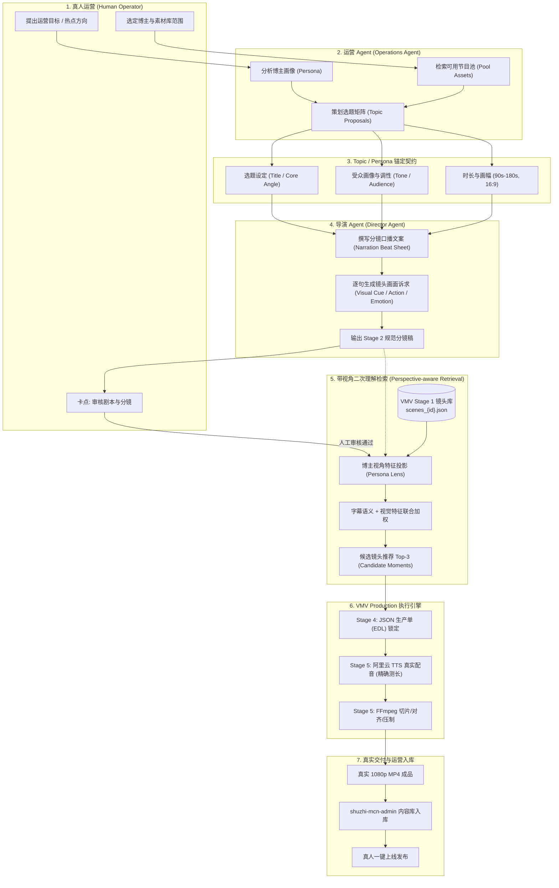

# POC-AGENT A0: 数智博主生产工作台与视频检索验证引擎接线架构方案

**版本**: v1.0.0-draft  
**状态**: `awaiting_review`  
**架构责任**: 🏛️ 全栈架构师 & 🚀 DevOps/SRE  
**涉及仓库**:
- 本地运营后台: `shuzhi-mcn-admin` (路径: `intelligent-pasteur/shuzhi-mcn-admin`)
- 视频检索验证引擎: `video-moment-validation` (VMV, 路径: `video-moment-validation`)

---

## 一、 背景与架构目标

### 1. 核心业务痛点
当前 MCN 运营后台（`shuzhi-mcn-admin`）具备了博主库配置、内容运营监控、选题批次编制、脚本初稿审核及内容库管理的完整操作链路，但目前其底层生成逻辑均为前端 JavaScript 定时器与静态 Mock 模拟（`durationMs = 7500`），未接入真实的 AI 智能体与视频生产管线。

与此同时，底层视频片段验证引擎（`video-moment-validation`, 简称 **VMV**）已在 Mac 本地建立了基于 Python 3.12、FFmpeg 7.0 和阿里云 TTS 的 Stage 0–6 技术验证流水线，具备从真实影视素材中探测镜头边界、提取时间码、依据脚本检索候选镜头，并编排生产单合成真实 MP4 样片的能力。

### 2. A0 阶段核心目标
**POC-AGENT A0** 阶段的唯一任务是：**盘点两端已有资产，设计“真人运营 → 运营Agent → Topic/Persona → Director → Retrieval/带视角二次理解 → VMV Production → 真实MP4”的真实接线方案**。
- **铁律一**：禁止重复实现 VMV 已有能力（音视频探测、场景检测、阿里云 TTS、FFmpeg 剪辑压制严禁在后台重写）。
- **铁律二**：A0 阶段聚焦于架构设计与协议契约规范，不编写任何业务功能代码。
- **铁律三**：端到端闭环必须以“真实影视素材”、“真实口播音频”及“真实可播放 MP4 成片”为最终交付物。

---

## 二、 现有资产与代码能力深度盘点

### 1. `shuzhi-mcn-admin` 运营后台盘点

经过对 `app.js`、`demo-logic.js`、`styles.css` 及测试套件的系统性审查，后台已具备以下五大业务模块资产：

| 模块 | 核心源码与函数 | 现有能力 | 接线改造点 / 剥离点 |
| :--- | :--- | :--- | :--- |
| **博主库 (Bloggers / Creators)** | `BLOGGER_PHOTOS`<br>`buildBloggerMetrics`<br>`newBlogger` | 管理博主基本资料（ID、姓名、标签、人设描述、声线设定）、绑定节目素材池（Program Assets & Highlights）、肖像资源与本地/远程降级机制。 | 保留现有博主配置体系，为人设（Persona）增加结构化的“视角Prompt模板”与“声线TTS音色编码”。 |
| **内容运营 (Content Operations)** | `buildProductionMonitorSummary`<br>`mergeBulkProductionRoster`<br>`monitorBlogger` | 支持多博主轮巡监控、最多 5 人花名册动态排队、生产监控面板与内容库解耦、任务卡片状态显示。 | 剥离前端假跑定时器，改为订阅真实的异步任务作业状态（Job Status）。 |
| **创建内容 (Creation & Topic)** | `prepareTopicBatch`<br>`remapTopicBatchForPool`<br>`assignUniqueClips`<br>`generateDrafts` | 选题批次规格管理（时长 90–300s，16:9 画幅）、跨博主资产池动态映射、重叠选题贪心回溯唯一切片分配、生成带完整口播文案的初稿。 | 将纯前端模板文案生成替换为 **运营Agent** 与 **导演Agent (Director)** 智能生成流。 |
| **审核台 (Script Review)** | `reviewDraft`<br>`ScriptReview` 页面组件 | 逐篇独立审核台词脚本，提供通过/驳回与意见反馈，全部审核通过后流转至生产。 | 保留真人审核卡点（Human-in-the-loop），审核通过事件触发下游 VMV 生产流水线。 |
| **内容库 (Content Library)** | `listApprovedContentItems`<br>`collectCreatorContent`<br>`setContentOnline` | 聚合各博主已过审成品，按审核完成时间倒序列表展示，支持上下架状态切换、关联节目详情与海报预览。 | 增加真实 MP4 的播放器直读能力与渲染参数元数据展示。 |

### 2. `video-moment-validation` (VMV) 引擎盘点

VMV 是本地运行的专业视频理解与视听渲染引擎（Python 3.12 + FFmpeg + 阿里云 TTS），各阶段能力划分清晰明确：

| 阶段 (Stage) | 现有实现与关键产物 | 核心能力职责 | 运营后台与 Agent 的消费方式 |
| :--- | :--- | :--- | :--- |
| **Stage 0 (环境与准备)** | `src/vmv/cli.py`<br>`outputs/stage0/environment.html` | 验证 Python 3.12、FFmpeg 7.0、ffprobe、Git 与 AGY 运行环境达标。 | 提供底层系统能力保障，后台启动时可健康检查。 |
| **Stage 1 (素材导入与切分)** | `src/vmv/media.py` (PR #5)<br>`media_manifest.json`<br>`scenes_{media_id}.json` | 输入 20–30 分钟影视素材（如《潜伏》），探测音视频轨、软字幕，执行 ffmpeg 场景转换检测（Scene Detection），输出入出点、时长及帧区间时间码清单。 | **核心输入源**：Agent 检索镜头的基础元数据库，提供唯一的片段时间码基准。 |
| **Stage 2 (口播拆段与画面诉求)** | `Stage 2 Specification`<br>`script_segments.json` | 将口播文案按语义拆为独立台词句（Beat），为每句标定画面诉求（剧情、人物、动作、场景、情绪）。 | **由 Director Agent 驱动**：根据博主人设直接生成符合 Stage 2 规范的结构化分镜。 |
| **Stage 3 (候选镜头检索)** | `Stage 3 Specification`<br>`candidates_{beat_id}.json` | 联合台词字幕语义、镜头关键帧视觉标签与人物特征，检索返回 Top-3 候选镜头。 | **结合带视角二次理解**：博主的人设特征在此阶段作为打分权重与重排条件。 |
| **Stage 4 (生产单编排)** | `Stage 4 Specification`<br>`production_manifest.json` (EDL) | 记录最终选定素材 ID、入点（In-point）、出点（Out-point）、对应台词文本与转场规则。 | **标准交付契约**：后台审核通过后，输出此标准 JSON 作为生产指令。 |
| **Stage 5 (TTS 与 MP4 合成)** | `Stage 5 Specification`<br>`final_output.mp4` | 调用阿里云 TTS 合成自然语音并获取精确音频时长，FFmpeg 执行帧级精准剪切、画面缩放（16:9）、拼接及字幕压制。 | **黑盒执行**：后台绝不插手底层剪切压制，仅监听生产进度与结果文件。 |
| **Stage 6 (指标与结论)** | `Stage 6 Specification`<br>`reports/stage6-metrics.json` | 记录候选可用率（≥80% 达标线）、耗时、改动量及成本。 | 回传至后台大屏，沉淀运营优化数据。 |

---

## 三、 全链路真实接线方案架构设计

整个系统的运行脉络遵循以“人机协同（Human-in-the-loop）”为核心的 7 级流水线：



---

## 四、 核心节点接线细节与“带视角二次理解”机制

### 1. 为什么必须“带视角二次理解 (Perspective-aware Retrieval)”？
在影视切片和数智博主场景中，**没有客观中立的镜头检索**。
- **普通检索**：搜索“余则成坐在桌子前”，只匹配台词字面或视觉对象分类（`sitting at desk`），结果平庸生硬。
- **带视角二次理解**：
  - 如果当前博主是**职场博弈导师（如“老周职场录”）**，其视角透镜（Persona Lens）是“下属在复杂领导关系中的微表情与试探”；
  - 二次理解会将同一段素材识别为“表面汇报工作，实则利用信息不对称试探站队”，并优先打分高权重的“微表情克制特写”与“镜头推移压迫感”；
  - 如果当前博主是**历史悬疑解密博主**，同一镜头则被解释为“代号暴露前的伏笔线索”。
- **技术实现**：
  - 输入：VMV Stage 1 的原始分段数据（`scene_id`、起止时间码、台词、关键帧视觉描述）+ Director Agent 提出的单句意图；
  - 运算：通过博主 Persona 的视角 Prompt 模板，在检索召回候选集上执行一次轻量语义重排序（Re-ranking）与视角理由生成（`rationale`），确保镜头不仅画面吻合，更契合博主的表达风格。

### 2. 状态机流转与接线触发契约

后台作业从创建到成片的完整状态机如下：

```
[DRAFTING] (运营Agent规划选题)
    ↓
[SCRIPTING] (导演Agent生成分镜台词)
    ↓
[AWAITING_SCRIPT_REVIEW] (挂起：等待真人运营审核)
    ↓ (运营审核通过)
[RETRIEVING] (带视角二次理解与镜头检索)
    ↓
[AWAITING_MOMENT_REVIEW] (可选：镜头微调/采用)
    ↓ (确认生产单)
[VMV_PRODUCING] (VMV 执行：阿里云 TTS + FFmpeg 压制)
    ↓
[COMPLETED] (MP4 就绪，内容库入库可播放)
```

---

## 五、 数据交换接口与规范契约 (Schema Specifications)

### 契约 1: 选题与分镜脚本契约 (Director Agent → Review)
```json
{
  "$schema": "https://json-schema.org/draft/2020-12/schema",
  "topic_id": "topic-qianfu-001",
  "blogger_id": "creator-laozhou",
  "persona_tag": "职场博弈/沉稳老辣",
  "title": "从余则成两次倒水，看体制内如何向直接上级汇报",
  "target_duration_sec": 120,
  "aspect_ratio": "16:9",
  "beats": [
    {
      "beat_id": "beat-01",
      "narration_text": "很多人以为汇报工作是讲事实，其实老手汇报，先看的是领导桌上的杯子。",
      "target_duration": 4.5,
      "visual_requirement": {
        "character": "余则成 / 站长",
        "action": "端茶杯、眼神停顿、试探性交流",
        "scene": "保密局办公室",
        "emotion": "表面恭敬但暗流涌动",
        "perspective_lens": "职场微权力博弈视角"
      }
    }
  ]
}
```

### 契约 2: 生产单契约 (EDL Manifest: Review → VMV Production)
与 VMV Stage 4 标准完全对齐：
```json
{
  "production_id": "prod-20261005-001",
  "topic_id": "topic-qianfu-001",
  "blogger_id": "creator-laozhou",
  "voice_config": {
    "provider": "aliyun",
    "voice_id": "zh-laozhou-calm",
    "speech_rate": 1.05,
    "pitch_rate": 0.95
  },
  "segments": [
    {
      "segment_index": 1,
      "beat_id": "beat-01",
      "text": "很多人以为汇报工作是讲事实，其实老手汇报，先看的是领导桌上的杯子。",
      "assigned_clip": {
        "media_id": "qianfu_ep01",
        "scene_id": "scene_0042",
        "in_timecode": "00:08:14.200",
        "out_timecode": "00:08:18.700",
        "duration_sec": 4.5
      }
    }
  ],
  "output_settings": {
    "resolution": "1920x1080",
    "fps": 25.0,
    "format": "mp4",
    "burn_subtitles": true
  }
}
```

### 契约 3: 生产状态回执契约 (VMV Production → Admin Monitor)
```json
{
  "job_id": "job-prod-20261005-001",
  "status": "producing",
  "stage": "stage5_ffmpeg_render",
  "progress_percent": 68,
  "stage_details": {
    "tts_status": "completed",
    "audio_duration_sec": 118.4,
    "current_clip_rendering": 8,
    "total_clips": 12
  },
  "artifacts": {
    "audio_path": "outputs/audio/speech_001.mp3",
    "video_path": "outputs/video/final_output.mp4",
    "poster_path": "outputs/video/poster.jpg"
  },
  "error": null
}
```

---

## 六、 实施与推进路线图 (Roadmap)

- **A0 (当前里程碑 - 架构与规约)**:
  - 完成两端资产盘点；
  - 输出全链路接线架构文档与数据交换契约；
  - 明确系统边界与不重复实现原则；
  - 待用户 Review 确认。
- **A1 (协议层打通与 Mock 剥离)**:
  - 改造 `shuzhi-mcn-admin` 中的 `job` 状态驱动机制，支持接收符合 JSON 契约的外部任务载荷；
  - 在 VMV 端提供标准化 Runner 命令行或本地任务接口（读取生产单，执行 Stage 5 输出 MP4 并产出状态文件）。
- **A2 (Agent 编排与带视角理解服务)**:
  - 实现基于博主 Persona 的 Director Agent 分镜生成器；
  - 接入 Stage 1 镜头数据，实现带有博主视角的检索重排与候选推荐。
- **A3 (端到端真实素材全链路验证)**:
  - 使用一段 20–30 分钟影视素材（如《潜伏》），真人运营在后台配置老周博主；
  - 跑通运营 Agent → 选题 → 剧本审核 → 镜头推荐 → 真实阿里云 TTS 配音 → FFmpeg 压制；
  - 产出真实 MP4 并成功在后台内容库完成在线播放与上线流转。

---

## 七、 结论与审查要点 (Review Checkpoints)

1. **边界清晰**：MCN 前端负责交互、展示与真人决策；Agent 负责规划与分镜理解；VMV 负责硬核视听素材检索与音视频压制。两者之间通过清晰的 JSON 文件/接口进行解耦通信。
2. **零重复造轮子**：严格复用 VMV 的 ffprobe、ffmpeg 场景检测、阿里云 TTS、MP4 渲染底层。
3. **真实交付物保障**：拒绝纯前端数字递增假跑，确保进入生产后生成的是物理磁盘上的真实 MP4 视频文件。
