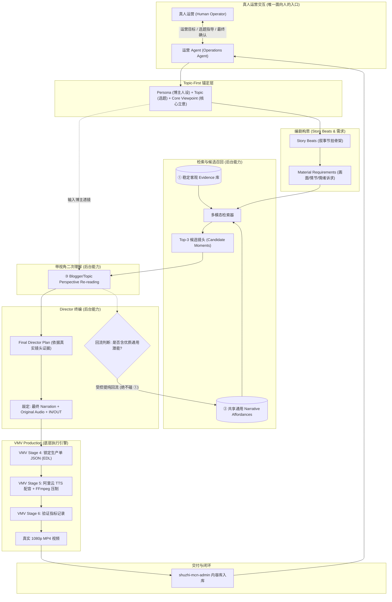

# POC-AGENT: 数智博主端到端生产工作台接线架构方案 (Topic-First Architecture)

**版本**: v2.0.0-draft  
**状态**: `changes_requested` → 修订后重新标记为 `awaiting_review`  
**核心责任**: 🏛️ 全栈架构师 & 🚀 DevOps/SRE  
**跨仓库协作**:
- **运营中枢**: `shuzhi-mcn-admin` (本地路径: `intelligent-pasteur/shuzhi-mcn-admin`)
- **视听引擎**: `video-moment-validation` (VMV, 本地路径: `video-moment-validation`)

---

## 一、 架构总原则与定位校准

### 1. 唯一面向真人的交互入口 (Single Interaction Portal)
- **运营Agent (Operations Agent)** 是**全系统唯一面向真人运营的交互入口**。
- 真人运营不与底层模型、算法或剪辑器直接对话，所有运营意图、热点注入、博主选定、脚本决策与过程干预，均通过运营后台的运营Agent交互窗口或卡点界面完成。
- **Director（导演编排）、Retrieval（检索召回）、Perspective Engine（视角解读引擎）、Production Pipeline（VMV 剪辑流水线）等均为纯后台能力与管道服务（Backend Capabilities）**，严禁将所有后台微服务盲目“Agent 化”，避免无效的多 Agent 握手损耗。

### 2. Topic-First 真实证据闭环 (Topic-First, Evidence-Grounded)
严禁“先脱离素材凭空闭门造车写死台词，再去强行拼凑镜头”。真正的专业影视二次创编遵循严格的 **Topic-First 真实证据闭环**：
> **真人运营 ↔ 运营Agent**  
> `→` **Persona / Topic / Core Viewpoint** (博主人设 / 选题 / 核心立意)  
> `→` **Story Beats** (叙事节拍骨架)  
> `→` **Material Requirements** (每个节拍的剧情/画面/人物/情绪诉求)  
> `→` **共享客观 Evidence Library 检索**  
> `→` **Top 候选镜头召回**  
> `→` **基于当前博主 + 选题的 Perspective Re-reading (带视角二次理解)**  
> `→` **Director 根据真实镜头证据完成 Final Director Plan**  
> `→` **敲定最终 Narration (解说台词) / Original Audio (原声留白与台词) / 精准 IN-OUT 时间码**  
> `→` **复用 VMV Stage 4/5/6 生产流水线**  
> `→` **产出真实 1080p MP4 成片**

### 3. 禁止重复实现 (No Reinventing the Wheel)
- 后台严禁重新实现视频抽帧、场景切分检测、音视频属性探测、阿里云 TTS 驱动、FFmpeg 剪切拼接或字幕压制。
- 上述能力完全复用 `video-moment-validation` (VMV) 已有及已验证的 Stage 1–6 核心管道。

---

## 二、 素材理解的三层架构与知识回流机制

素材的理解必须解耦为相互独立的三层，严禁混为一谈：

```
┌────────────────────────────────────────────────────────────────────────┐
│  【第三层】每条内容动态生成的博主视角解读 (Dynamic Perspective Reading)     │
│  - 基于当前博主 Persona + 选题 Core Viewpoint 动态生成                   │
│  - 专属当前视频，极具主观洞察（例如：“余则成端茶是体制内下属借势试探”） │
└─────────────────────────────────┬──────────────────────────────────────┘
                                  │ 经过真实验证的高价值通用模式
                                  │ 选择性受控回流 (Selective Promotion)
                                  ▼
┌────────────────────────────────────────────────────────────────────────┐
│  【第二层】共享、可持续增量的通用叙事潜能 (Generic Narrative Affordances)  │
│  - 跨博主、跨选题共享，持续沉淀增量                                    │
│  - 戏剧功能与叙事潜能（例如：对峙、试探、压抑、假意顺从、转折、权力展示）│
└────────────────────────────────────────────────────────────────────────┘
                                  │ 严格物理只读与隔离
                                  │ (Strict Isolation - No Write Back)
                                  ▼
┌────────────────────────────────────────────────────────────────────────┐
│  【第一层】稳定、中立、不可篡改的客观证据库 (Objective Evidence Library)  │
│  - 物理时间码、入出帧、人物面部识别、原片台词字幕、物理动作、场景机位   │
│  - 由 VMV Stage 1 及物理探测生成，绝对客观事实，任何上层不可污染！       │
└────────────────────────────────────────────────────────────────────────┘
```

### 1. 第一层：稳定客观 Evidence Library (物理事实层)
- **定义**：影视素材中不可动摇的客观物理事实。
- **包含内容**：
  - 片段全局唯一标识（`media_id`, `scene_id`）；
  - 精确时间码（`in_timecode`, `out_timecode`, `duration_sec`, 帧范围）；
  - 原片字幕台词原文（ASR / 软字幕提取，带字级时间戳）；
  - 出场人物（基于人脸/声纹比对，如：余则成、吴敬中、李涯）；
  - 物理动作与环境标签（如：室内、白天、办公桌前、端茶倒水、关门、掏枪）；
  - 镜头语言基准（全景/中景/特写、推镜头/静止、人物视线方向）。
- **铁律**：**完全只读，禁止任何上层主观解读污染或篡改底层客观证据库！**

### 2. 第二层：共享、可持续增量的 Generic Narrative Affordances (通用叙事潜能层)
- **定义**：素材片段在戏剧叙事学与视听语言层面上所具备的“通用表现力潜能（Affordance）”。
- **包含内容**：
  - 戏剧功能分类：试探（Probing）、对峙（Confrontation）、隐瞒（Concealment）、背叛（Betrayal）、权力压迫（Power Dominance）、心理破防（Breakdown）、假意顺从（Subservience）、信息差博弈（Information Asymmetry）；
  - 情绪张力基线：紧张度评分（0–1.0）、节奏快慢（缓/急）、压迫感指数；
  - 视听留白价值：片段是否包含优质原声金句、环境音效（雷声、秒针走动声）、戏剧性沉默（Dramatic Pause）。
- **特性**：跨博主、跨选题通用复用，随内容生产历史不断增量丰富，为所有检索提供高质量语义索引。

### 3. 第三层：动态生成的 Blogger / Topic Perspective Reading (视角解读层)
- **定义**：在具体内容生产上下文中，将博主的主观人设（Persona）与选题核心立意（Core Viewpoint）投影到候选镜头上所产生的“特化解读”。
- **案例对比（同一段素材在不同博主下的第三层解读）**：
  - *镜头素材*：余则成恭敬地给吴敬中点烟，吴敬中眯眼吐烟圈（第一层客观事实；第二层叙事潜能：试探/权力压迫）。
  - *博主 A（职场老周，职场博弈人设）的第三层解读*：“面对空降老油条领导，不要急于表功，倒水点烟时的沉默留白，是在给领导释放‘我知进退、懂规矩’的服从信号。”
  - *博主 B（历史谍战解密，悬疑拆解人设）的第三层解读*：“注意吴站长眼睛余光的停留位置——这处细节表明，老狐狸早在第 3 集就已经对余则成的潜伏身份产生了第一道怀疑链。”
- **生命周期**：随每次内容批次即时生成，初始仅绑定于该视频 Draft。

### 4. 动态解释向通用叙事潜能选择性回流机制 (Promotion & Protection Pipeline)
为了让系统持续进化，同时誓死保卫客观层安全，设计如下回流机制：
1. **单向隔离防污染**：任何回流**严禁写入第一层 Evidence Library**。第一层始终保持纯物理只读。
2. **候选提升规则 (Affordance Promotion Rule)**：
   - 当某个镜头在多次不同内容的第三层解读中，反复体现出相似的高维戏剧功能（例如“借势试探”被多次验证）；
   - 或某条成片在发布后获得良好正向反馈（完播率高、人工 Review 标记为“神级剪辑配比”）；
   - 该解读经过抽象化提纯（去博主专属主观文案，保留通用戏剧结构描述），晋升（Promote）为第二层的 `Narrative Affordance Tag`；
3. **入库门禁**：回流机制必须通过结构化 Schema 校验，并打上 `source: promoted_from_draft` 与置信度权重，方可并入第二层。

---

## 三、 Topic-First 端到端接线全链路



---

## 四、 详细链路数据流与契约规范

### 1. 阶段 1：Topic & Story Beats 构思契约 (运营Agent 产出)
```json
{
  "topic_id": "topic-qf-20261005-01",
  "blogger_id": "creator-laozhou",
  "persona": {
    "name": "老周聊职场",
    "tone": "老练冷静、以戏喻局、洞察隐性博弈",
    "core_lens": "体制与大型组织的微权力运转、下属向上汇报策略"
  },
  "topic": {
    "title": "从余则成两次倒水，看体制内如何向直接上级汇报",
    "core_viewpoint": "汇报的最高境界不是汇报事实，而是通过动作留白建立领导的安全感与掌控感。"
  },
  "story_beats": [
    {
      "beat_id": "beat-01",
      "beat_title": "黄金开场钩子",
      "target_duration_sec": 4.5,
      "narrative_function": "打破常规认知",
      "material_requirements": {
        "characters": ["余则成", "吴敬中"],
        "scene_env": "保密局办公室",
        "action_cue": "倒茶或端茶具、动作克制",
        "emotional_tone": "平静下有试探张力",
        "preferred_affordance": ["试探", "权力压迫"]
      }
    }
  ]
}
```

### 2. 阶段 2：候选镜头召回契约 (检索后台基于 L1 + L2 返回 Top-3)
```json
{
  "beat_id": "beat-01",
  "candidates": [
    {
      "candidate_id": "cand-01",
      "scene_id": "qianfu_ep01_scene_0042",
      "timecode": { "in": "00:08:14.200", "out": "00:08:19.400", "duration_sec": 5.2 },
      "evidence_l1": {
        "dialogue": "站长，您喝茶。",
        "actions": ["余则成双手递茶", "吴敬中翻看卷宗未抬头"],
        "camera": "中景侧拍"
      },
      "affordance_l2": {
        "tags": ["权力等级展现", "汇报试探", "视线压迫"],
        "tension_score": 0.65
      }
    }
  ]
}
```

### 3. 阶段 3：Perspective Re-reading (第三层动态视角解读)
```json
{
  "candidate_id": "cand-01",
  "blogger_perspective_reading": {
    "core_insight": "吴敬中头也不抬，说明汇报者此时多说半句都是错。余则成的身体微屈但步伐极稳，是教科书级的服从性测试应对。",
    "recommended_focus": "强调余则成递茶的手部动作与吴站长的冷淡反应之间的反差",
    "suggested_original_audio_usage": "保留原片中‘站长，您喝茶’这声原音，随后接博主画外解说"
  }
}
```

### 4. 阶段 4：Final Director Plan 契约 (Director 锁定，输入 VMV Stage 4)
Director **看到真实镜头证据后，精确敲定台词、原声与入出点**：
```json
{
  "production_id": "prod-qf-20261005-001",
  "topic_id": "topic-qf-20261005-01",
  "blogger_id": "creator-laozhou",
  "voice_config": {
    "provider": "aliyun",
    "voice_id": "zh-laozhou-calm",
    "speech_rate": 1.05
  },
  "director_timeline": [
    {
      "timeline_index": 1,
      "beat_id": "beat-01",
      "selected_clip": {
        "media_id": "qianfu_ep01",
        "scene_id": "qianfu_ep01_scene_0042",
        "in_timecode": "00:08:14.200",
        "out_timecode": "00:08:18.900",
        "duration_sec": 4.7
      },
      "audio_track_plan": {
        "original_audio_preserve": {
          "enabled": true,
          "range": "00:08:14.200 - 00:08:15.500",
          "volume_percent": 100
        },
        "narration": {
          "text": "高手向上汇报，第一句话永远不在嘴上，而在这杯茶的轻重里。",
          "start_delay_sec": 1.3
        }
      }
    }
  ]
}
```

---

## 五、 A0–A10 分阶段实施路线与双门禁 (Two-Gate Roadmap)

本方案严禁跳跃式推进，必须按顺序经过如下 11 个里程碑阶段及两个关键门禁（Gate）：

```
[A0: 架构与接线设计] ──► 🚪【Gate 1: A0 Review Gate】(当前卡点)
      │ (通过后)
      ▼
[A1: 运营中枢后台交互与作业协议改造]
      ▼
[A2: 物理客观 Evidence 库与 Stage 1 摄取接入]
      ▼
[A3: 共享通用 Narrative Affordances 库构建]
      ▼
[A4: Topic-First 创意生成链路接入 (真人运营↔运营Agent)]
      ▼
[A5: 候选镜头召回与 Top-3 检索管道]
      ▼
[A6: 动态 Perspective Re-reading 引擎] ──► 🚪【Gate 2: Retrieval Top3 实测 Gate】
      │ (实测命中率 ≥ 80% 通过后)
      ▼
[A7: Director 真实证据终编服务 (Final Director Plan)]
      ▼
[A8: VMV Stage 4/5 真实生产对接 (阿里云TTS + FFmpeg MP4)]
      ▼
[A9: 动态解释向通用 Affordance 受控回流机制落地]
      ▼
[A10: 最终双博主同素材 A/B 验证 (同部剧/双人设/双MP4对比)]
```

### 1. 两个核心门禁定义 (Gates)
- **🚪 Gate 1: A0 Review Gate (当前门禁)**
  - **验收内容**：审查本架构方案、Topic-first 数据流、三层素材理解模型与回流机制、A0–A10 路线图。
  - **通过标准**：真人运营与评审确认架构方案及协议契约完全无异议。未通过前严禁进入 A1。
- **🚪 Gate 2: Retrieval Top3 实测 Gate (检索实测门禁)**
  - **验收内容**：在 A6 完成后，使用一段 20–30 分钟真实影视素材（如《潜伏》），对 10 个以上 Story Beat 的画面诉求进行真实镜头检索并应用 Perspective Re-reading。
  - **通过标准**：**前 3 个候选镜头中至少有 1 个可用镜头的脚本段落占比 ≥ 80%**。未达标前严禁进入 A7/A8 大规模合成。

### 2. A0–A10 阶段详细规划
| 阶段 | 核心任务 | 交付物 / 验收标准 | 依赖项 |
| :--- | :--- | :--- | :--- |
| **A0** | 架构设计、Topic-first 接线、三层素材理解与回流机制、规范契约 | `docs/agent-poc/agent-poc-architecture.md`<br>`PROGRESS.md` | **Gate 1** |
| **A1** | 改造 `shuzhi-mcn-admin` 运营Agent 入口与任务状态流转，剥离前端虚拟定时器 | 运营Agent 对话窗口与异步 Job 状态订阅器 | Gate 1 |
| **A2** | 接入 VMV Stage 1 产物，构建底层不可篡改的 Evidence Library (L1) | `evidence_store.py` / L1 数据校验套件 | A1 |
| **A3** | 设计戏剧功能分类与情绪标签体系，建立共享 Narrative Affordances (L2) | `affordance_registry.json` 与增量索引接口 | A2 |
| **A4** | 实现真人运营 ↔ 运营Agent 对话链路，产出 Topic/Persona/Beats/需求规范 | 运营Agent 创意生成工具链 | A3 |
| **A5** | 对接 Stage 1+2 镜头多模态检索，返回 Top-3 候选集 | 候选镜头召回服务 | A4 |
| **A6** | 实现博主视角透镜二次解读服务 (L3 Reading) | Perspective Re-reading 引擎 | **Gate 2** |
| **A7** | 实现 Director 终编服务，根据真实镜头证据敲定台词、原声、IN-OUT | Final Director Plan 生成器 | Gate 2 |
| **A8** | 接通 VMV Stage 4/5 生产管道，调用阿里云 TTS 与 FFmpeg 生成真实 MP4 | 本地生产 Runner 与真实 MP4 视频输出 | A7 |
| **A9** | 落地高价值解读向通用 Affordance 受控回流机制与隔离防护 | 知识回流提纯流水线 | A8 |
| **A10** | **双博主同素材 A/B 验证**：同一部素材分别跑通“职场老周”与“谍战解密” | 两支风格截然不同的真实 1080p MP4 及全流程指标报告 | A9 |

---

## 六、 最终验证目标：双博主同素材 A/B 实测 (A10)

为彻底验证“带视角二次理解”与 Topic-First 架构的不可替代性，全案终极交付物必须包含 **同素材双博主 A/B 验证**：

1. **输入基准素材**：《潜伏》第一集（25 分钟测试视频）。
2. **博主 A（职场老周）**：
   - *人设*：成熟、老辣、体制内职场生存逻辑。
   - *产出*：聚焦人情世故、站队试探、汇报潜台词；口播沉稳，大量利用眼神停顿与留白；生成《余则成教你向一把手汇报》MP4。
3. **博主 B（谍战密档解密）**：
   - *人设*：悬疑、快节奏、蛛丝马迹解密。
   - *产出*：聚焦道具破绽、镜头隐藏线索、生死博弈；口播紧张紧凑，快速剪辑转场；生成《吴站长到底何时识破余则成》MP4。
4. **验证结论**：两支成片使用**同一素材库**，但在各自主观视角透镜作用下，选取的镜头片段、二次解读文案、配音音色与成片节奏呈现出截然不同的艺术生命力，彻底证明本接线架构的有效性。
