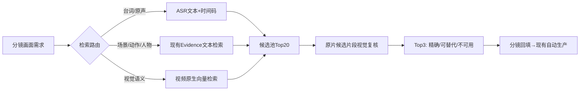

# 数智博主 POC｜开源项目源码研究与“会找”技术决策（2026-10-09）

> 状态：**源码静态审查已完成；尚未下载模型、运行开源项目、使用《潜伏》做对照实验。** 本文所有“可复用”均指架构/代码候选，**不是效果已验证**。研究基于 2026-10-09 所见 GitHub 仓库主分支。对应 MCN 验证分支 agent-poc/a1-contracts，研究前 HEAD 为 58305e38。

## 0. 执行摘要

**建议：不要把“会找”整体替换成某个开源项目。优先以现有 VMV 镜头索引为骨架，增加两条并行召回通道（原生视频向量检索、台词 ASR 时间码检索），再做候选片段的二次视觉核验。** 先用 Q1–Q5 做同素材对照；未验证前不宣称检索命中率提升。



**约束：**指定原声台词、剧情事实和关键动作不可用“氛围类似”代替；只有非事实性过场镜头允许可接受替代。每条结果必须返回原始文件、起止时间、依据、置信度与未命中原因。严禁将检索评分等同事实正确率。

## 1. 四个仓库的源码结论

| 仓库 | 实际源码证据 | 可以借鉴 | 不能直接推断 |
|---|---|---|---|
| [SentrySearch](https://github.com/ssrajadh/sentrysearch) | `sentrysearch/search.py`：文本/图片向量→store.search→按相似度排序→去重；`chunker.py`负责切片；README：重叠视频块→Gemini Embedding 2/Qwen3-VL→ChromaDB；有 MLX/本地后端、reranker 文件 | **最优先做并行视觉召回基线**；返回 `source_file,start_time,end_time,similarity_score`，易转 VMV 候选格式 | 默认30秒块可能过粗，不能保证精确镜头边界、角色身份、剧情动作或原声；需要二次定位与复核 |
| [VideoAgent](https://github.com/HKUDS/VideoAgent) | `environment/roles/vid_searcher.py`：读取 `video_scene.json` 的 `segment_scene`，调用 `videorag.videoragcontent.VideoRAG(...).query(query, QueryParam(mode="videoragcontent"))`；依赖预加载素材/场景 | **借鉴“结构化分镜需求→VideoRAG查询”的接口和多工具编排**；复杂需求可作复核研究方向 | 当前所审 `_process_scene` 返回 `status:success`，未直接向调用者返回结构化镜头候选；不应把它当成现成的可接入 Top3 API |
| [NarratoAI](https://github.com/linyqh/NarratoAI) | `app/services/prompts/film_tv_narration/script_matching.py`：审核后口播→按句切分→结合剧情分析和**原片字幕时间码**→生成含 video_id、timestamp、picture、narration、OST 的剪辑 JSON；服务文件见 `app/services/task.py`、`script_service.py`、`video_service.py` | **强烈值得借鉴“口播审核后再做时间码匹配”的契约**；可借其原声占比/非剧情片段排除/剪辑 JSON 结构；与我们的“会想→会找”对接密切 | 其提示词明确主要依赖字幕匹配；**不能据此认定其已解决无台词动作/人物细粒度视觉命中**；LLM 输出 timestamp 需源证据校验 |
| [FunClip](https://github.com/modelscope/FunClip) | `funclip/videoclipper.py` 的 `VideoClipper.recog` 通过 FunASR 识别，保留 `timestamp` / `sentence_info`，支持说话人相关选项、分句和字幕输出 | **Q3 指定原声台词检索**：ASR→规范化文本→精确/模糊匹配→词/句时间戳→源音频人工听检 | 中文 ASR 在《潜伏》具体音轨上的正确率未验证；“文本检索命中”≠音频确实说出，不能跳过源音频验证 |

### 1.1 SentrySearch 源码细节

- `search_footage(query, store, n_results, dedupe_threshold)` 调 `embed_query`，再经 `_search_with_embedding` 调 `store.search`；可选按向量相似度去重；输出有源文件/起止时间/相似度。
- 默认30秒、5秒重叠（README），适合**粗召回**，但 VMV 分镜通常3–8秒，必须把命中块映射回现有 shot_id，或在块内重切/复核。
- README 声明原生视频 embedding **不需要先生成字幕或逐帧文字描述**；恰好补足旧 Evidence 漏写动作导致召回缺失的风险。
- MLX 适配 Apple Silicon，符合本地 M2 试验方向；**是否能在现有机器内存/时长内跑通仍需实测**。
- license: Apache-2.0。

### 1.2 VideoAgent 源码细节

- `VideoSearcher` 接受 `video_scene_path`，取 JSON 中 `segment_scene` 字段调用 VideoRAG；源码明确 `VideoPreloader`、`VideoSearcher`、`VideoEditor` 需协作。
- 所审入口是场景级 query，不是通用“给一句话直接返回精准视频起止时间”的即插即用接口。
- 推荐**参考其流程拆分，不优先移植整个重型多 Agent 框架**；先确认 VideoRAG 返回的引用是否有可用时间码和片段引用。
- license: MIT。

### 1.3 NarratoAI 源码细节

- `ScriptMatchingPrompt` 要求以审核后文案、剧情理解材料、原字幕为输入，返回剪辑 JSON；显式规避片头片尾、广告、预告；按字数估算画面时长；支持 OST 原声占比。
- 与当前 POC 最大差别：我们要求**先由分镜定义画面需求，再从素材库取证**；NarratoAI 的字幕时间码匹配可作为一条候选路径，不能覆盖无台词的镜头。
- 建议抽象可复用**数据契约与审核节点**，不要覆盖已有 VMV FFmpeg 合成系统。
- license: MIT。

### 1.4 FunClip 源码细节

- `VideoClipper.recog` 通过 ASR 返回规范化的文字和时间戳，具备说话人结果接口线索。
- Q3 应单列“音频证据”通道：文本归一化→召回→原音频核对→精确到句时间戳→对齐对应视频；无法听证则标记“不可核实”，不可宣称 Gold present/absent。
- license: MIT。

## 2. 现有项目如何最小改造

保留：现有 VMV 镜头切分、Evidence、shot_id、原片时码、剪辑单、TTS、混音、字幕、MP4；MCN 现有运营审核流程。

新增 **三个窄接口**，不要大规模重构：
1. `retrieve_visual(query, source_scope, top_k)`：现有 Evidence 检索与 SentrySearch 风格原生视频 embedding 作为两个可比较召回源。
2. `retrieve_dialogue(exact_or_fuzzy_text, source_scope)`：ASR 文本+时间码，返回“待听证”的原声候选。
3. `verify_candidates(storyboard_requirement, candidates)`：读取原片候选短视频，不凭文本描述复核；输出 `exact / acceptable_substitute / unusable / uncertain` 和可核实理由。

统一候选契约示意：

```json
{
  "storyboard_id": "S01",
  "source_file": "qianfu_ep18.mp4",
  "start_sec": 100.0,
  "end_sec": 105.0,
  "shot_id": "shot_xxx",
  "retrieval_route": "evidence|video_embedding|asr",
  "evidence": {"visual": [], "dialogue": [], "limitations": []},
  "match_level": "exact|acceptable_substitute|unusable|uncertain",
  "verified": false
}
```

上例是**字段示意，不是真实检索结果**。

## 3. 对照试验设计：先有结果，再决定集成

**输入**：同一集《潜伏》、同一批 Q1–Q5 中立查询、相同源素材范围；原有 Evidence 索引与新原生视频向量索引分开，禁止把 Gold 位置注入检索器。

**对照组 A**：当前 VMV Evidence 文本召回；**试验组 B**：SentrySearch 风格视频向量召回；**试验组 C**：A+B 合并后候选视觉复核。Q3 额外用 FunClip/FunASR 音频召回。对每组保存 Top3 时间码和可播放原片切片。

**验收口径**：
- Q1、Q2、Q4、Q5：对 Top3 人工查看实际视频，逐条记录 `精确/可替代/不可用/不确定`；存在性未核实不算检索失败。
- Q3：人工听原声，核对台词与时间码；仅凭 ASR 文本不得判 PASS。
- 记录每条召回耗时、模型调用成本、一次建库时间、候选去重情况。
- **采纳门槛**：新方案在至少一类原有失败查询上出现可复核的增益，且没有明显增加错误自信/无法承受的成本；若无增益，保留旧链路，停止移植。
- **统计边界**：5 条只能作工程选型诊断，不代表规模化命中率；后续用新选题/新集做独立复跑。

## 4. 优先执行顺序与停损条件

| 顺序 | 操作 | 交付 | 停损 |
|---|---|---|---|
| 1 | 冻结现有 Q1–Q5 查询及源素材，导出当前 VMV Top3 基线 | 五条候选+时间码+人工结果 | 不能读到原片则暂停“实际命中率”结论 |
| 2 | 用 SentrySearch 的索引/检索思想对**同一份**视频做原生向量召回，优先本地/MLX | 同五条 Top3 + 运行日志 | 模型环境/内存不满足，改云端小样本，不迁移全库 |
| 3 | Q3 通过 FunASR 独立做台词定位 | ASR 文本、候选时码、音频复核 | 原声无法听证则标“不可核实” |
| 4 | 仅对 A/B Top 候选做短视频视觉复核 | 可看片的精确/替代/不可用判定 | 模型复核幻觉则保留人工最终裁决 |
| 5 | 选出增益明确的检索通道，接到“分镜→素材候选”接口 | 单条真实分镜的 Top3 与来源 | 无可复核增益就不合并 |
| 6 | 会想生成真实分镜→会找→既有自动生产→MCN 后台；换新选题复跑 | 不靠 CLI/JSON 的真实 MP4 | 未复跑不能宣布 POC 结束 |

## 5. 重要风险

- **版权与许可**：四个仓库分别 MIT/Apache-2.0；复用代码前核查依赖、模型权重及服务条款；影视原片仅限有权使用的验证素材。
- **源数据与隐私**：如用云端 embedding，会把影视片段上传第三方，须先确认素材许可和数据政策。
- **粒度错配**：30秒 embedding 片段不是可直接剪的 3–8 秒镜头；需 shot 映射和局部定位。
- **误判**：人物关系、剧情动作、原声台词不可仅用相似度或 VLM 口述确认。
- **数据泄漏**：人工 Gold 和正式盲测输入隔离；探索性通过不能算正式盲测通过。
- **进度口径**：今天 PPT 的“会想75%/会找65%”是项目管理进度，**不是模型准确率**。

## 6. 本次完成 / 未完成

**已完成**：四仓库真实路径及关键源码静态审查；明确 SentrySearch 粗召回、VideoAgent 场景→VideoRAG、NarratoAI 字幕时间码→剪辑 JSON、FunClip ASR 时间码；给出最小接入架构、对照实验、停损标准。

**未完成**：四仓库本地安装运行；对《潜伏》实际建索引；Q1–Q5 同素材对照；原音频人工听证；VMV 代码修改；MCN 后台端到端复跑。以上不应写为 PASS。

## 7. 参考源码（均为官方仓库）

- https://github.com/ssrajadh/sentrysearch/blob/master/sentrysearch/search.py
- https://github.com/ssrajadh/sentrysearch/blob/master/sentrysearch/chunker.py
- https://github.com/ssrajadh/sentrysearch/blob/master/sentrysearch/mlx_embedder.py
- https://github.com/HKUDS/VideoAgent/blob/main/environment/roles/vid_searcher.py
- https://github.com/linyqh/NarratoAI/blob/main/app/services/prompts/film_tv_narration/script_matching.py
- https://github.com/modelscope/FunClip/blob/main/funclip/videoclipper.py
